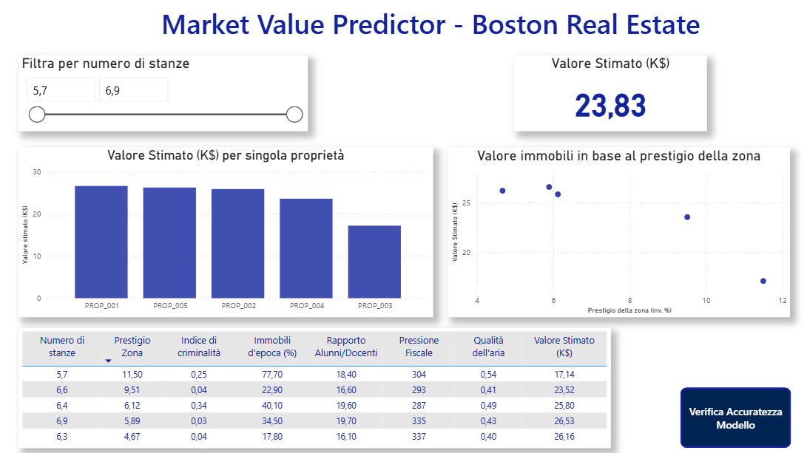
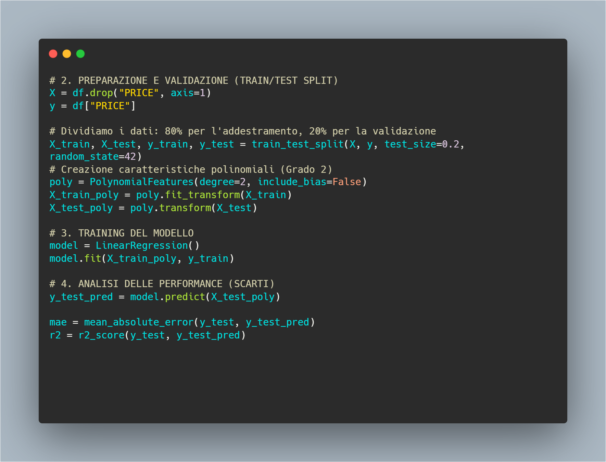
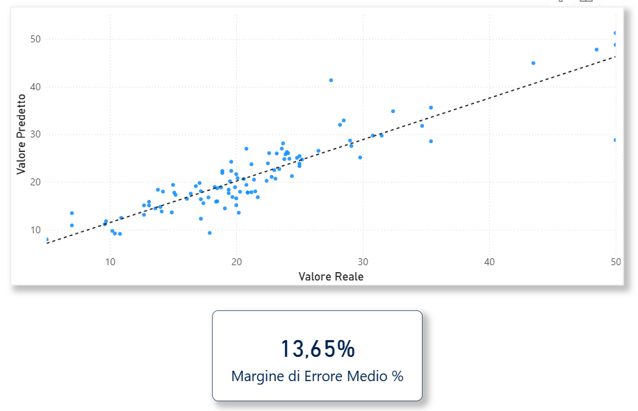

# Real Estate Predictive Analytics & Valuation Dashboard
### *End-to-End ML Pipeline & Business Intelligence Solution*

Questo repository presenta un sistema integrato per la valutazione automatizzata degli immobili basato sul dataset storico di Boston. Il progetto non è una semplice analisi statistica, ma una soluzione di **Business Intelligence** che trasforma modelli predittivi complessi in strumenti decisionali chiari e azionabili.

## 🎯 Visione del Progetto
L'obiettivo è colmare il gap tra l'analisi tecnica e la decisione strategica. Lo strumento consente a un investitore immobiliare di stimare il valore di mercato degli asset e, contemporaneamente, di monitorare l'affidabilità statistica delle previsioni attraverso un approccio di **Data Storytelling**.

## 📸 Visual Preview
Di seguito, un'anteprima della soluzione integrata:

### 1. Dashboard di Mercato (Power BI)

*Interfaccia interattiva per l'esplorazione del portafoglio e stima puntuale del valore del mercato immobiliare.*

### 2. Motore di Calcolo (Python)

*Implementazione della pipeline di Machine Learning e dei protocolli di anonimizzazione dei dati.*

### 3. Performance & Validazione

*Modulo tecnico per il monitoraggio delle performance del modello e l'analisi degli errori (MAE).*

## 🚀 Caratteristiche Principali
* **Motore di Calcolo:** Script Python con modello di **Regressione Polinomiale (Grado 2)** scelto per catturare relazioni non lineari tra variabili.
* **Data Ethics & Privacy:** Algoritmo di anonimizzazione integrato per la conformità **GDPR**, garantendo la protezione delle informazioni sensibili (sostituzione nomi proprietari con ID univoci), riflettendo il rigore operativo acquisito in contesti istituzionali.
* **Data Storytelling Dashboard:** Report Power BI a due pagine progettato con un'interfaccia *user-friendly* per rendere gli insight immediati anche per stakeholder non tecnici.
* **Validazione Scientifica:** Monitoraggio costante del **MAE (Mean Absolute Error)** per garantire la massima trasparenza sull'accuratezza del modello.

## 🛠️ Stack Tecnico
* **Linguaggi:** Python 3.11+
* **Librerie:** Pandas, Scikit-learn, Openpyxl, Matplotlib/Seaborn
* **BI Tool:** Power BI Desktop
* **Modello:** Polynomial Regression (Scikit-Learn)

## 📂 Struttura del Repository
* `/data`: Dataset Excel generati e anonimizzati.
* `/scripts`: Script Python per il preprocessing, la modellazione e la generazione degli output.
* `/dashboard`: Il file Power BI (.pbix) completo e pronto per la presentazione.
* `/img`: Documentazione visuale del progetto (Screenshot Dashboard e Code).

## ⚙️ Istruzioni per l'uso
1. Eseguire lo script Python per generare i file `Housing_Predictions_Boston_Anonymous.xlsx` e `Modello_Validazione_Performance.xlsx`.
2. Aprire il file Power BI.
3. Se necessario, aggiornare il percorso dei dati in **Power Query** (*Trasforma Dati -> Impostazioni Origine Dati*) per puntare alla cartella locale.

---
**Formazione:** Progetto certificato da **ProfessionAI** e **Alteredu**.
**Autore:** [Massimiliano Izzo](https://linkedin.com/in/massimilianoizzo) – BI & Data Storytelling Specialist
